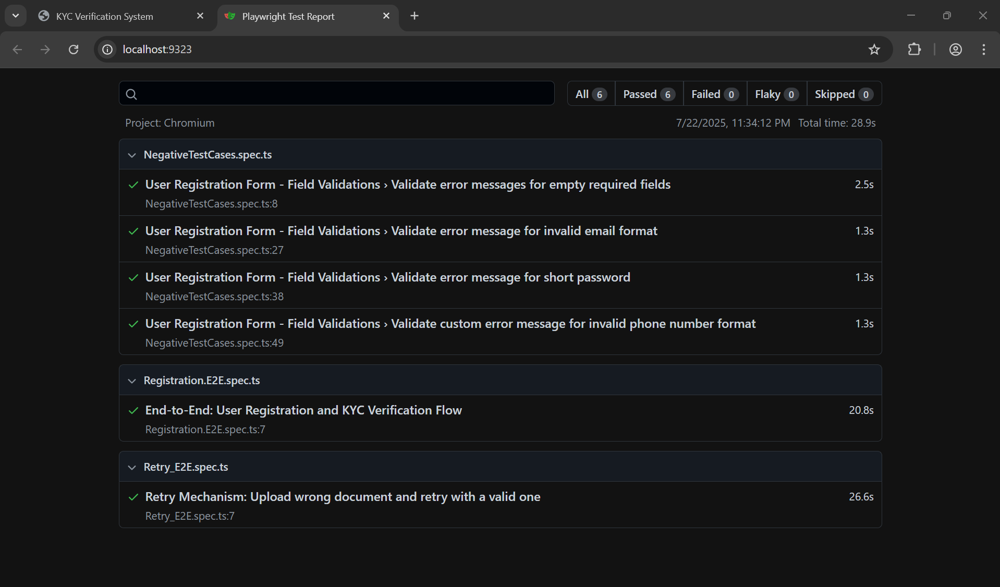

# 📱 Digital Wallet - Playwright E2E Test Suite

This project uses [Playwright](https://playwright.dev) to run automated end-to-end tests for a fintech digital wallet web app.

## 🔍 Project Overview

Features covered by tests:

- ✅ User registration with email, password, and phone number
- 📄 KYC document upload & verification
- 🔁 Retry mechanism for failed KYC attempts
- 💸 Access to payment feature after successful verification

## 🗂️ Project Structure

Vialet_Project/
├── tests/ # Test cases (e.g. Retry_E2E.spec.ts)
├── pages/ # Page Objects (RegistrationPage, KYCVerificationPage)
├── utils/ # Constants and data generation
├── testdata/ # KYC sample documents
├── playwright.config.ts
└── README.md


## 🚀 Getting Started

### 1. Install dependencies

```bash
npm install

2. Add test documents
Place the following files in the testdata/ folder:

valid_document.png

wrong_document.png

Ensure each file is under 5MB and in JPEG, PNG, or PDF format.

3. Start the KYC Web App (External Dependency)
Clone and run the mock KYC web app required for testing:
git clone https://github.com/<your-org-or-user>/kyc-mock-app.git

In one terminal:
cd kyc-mock-app/server
npm install
npm start

In another terminal:
cd kyc-mock-app/client
npm install
npm start


Backend runs at http://localhost:3000

Frontend runs at http://localhost:3001

4. Run tests
npx playwright test

5. View test report
npx playwright show-report

 Notes
KYC verification takes 2–20 seconds (mocked delay)

Valid files include "valid" in their filename (mock logic)

File paths in tests are handled using:

path.resolve(process.cwd(), 'testdata', fileName)

✅ This ensures compatibility across systems (Windows, macOS, Linux)

🤝 Used By
Product Teams A & B

Platform Engineering Team

QA for end-to-end flow coverage with external sandbox APIs

📸 Sample Test Report

✅ Best Practices Followed
Page Object Model for cleaner test code

All locators defined inside pages/ folder

test.step() used for structured, readable test execution

No hardcoded paths – everything works via process.cwd()

## 🖼️ Sample Test Result Screenshot



